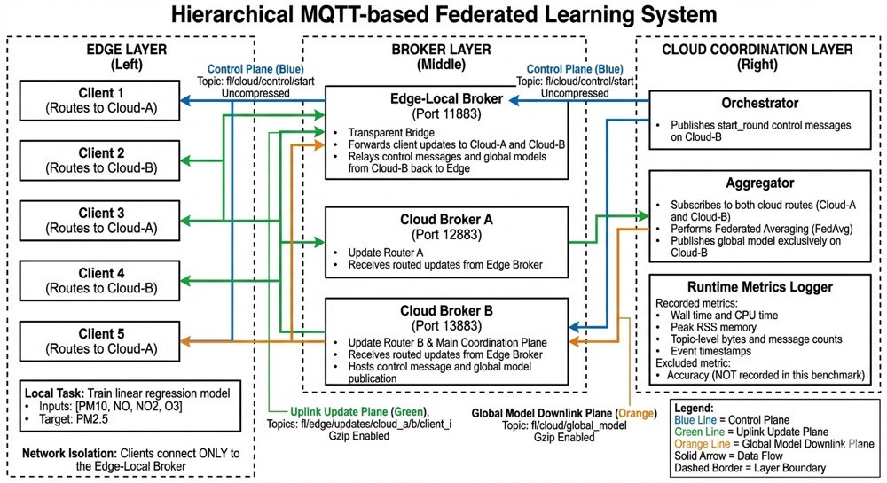

# Communication-Efficient Federated Learning in MQTT-based Edge-Cloud Systems

This repository contains the source code for a hierarchical multi-broker federated learning (FL) system operating over the Message Queuing Telemetry Transport (MQTT) protocol. This system is designed to address communication overhead and single-broker congestion issues inherent in traditional centralized MQTT-based FL frameworks for resource-constrained IoT environments.

The prototype demonstrates a practical application using a real-world air quality dataset from Newcastle to collaboratively train a linear regression model without exposing raw edge data to the cloud.

## System Architecture

The core innovation of this project is a decoupled, hierarchical edge-cloud topology that migrates from a baseline single-broker architecture to a tiered multi-broker design.

The system is structured across three primary logical layers:

1. **Edge Layer:** Emulates multiple distributed clients, each maintaining a local data shard. Edge devices are isolated from cloud-side network volatility by connecting exclusively to an Edge-Local Broker.
2. **Broker Layer:** Forms the communication backbone, divided into one Edge Broker and two parallel Cloud Brokers (Cloud-A and Cloud-B). The Edge Broker acts as a transparent bridge, distributing upstream client updates across Cloud-A and Cloud-B to prevent single-point congestion.
3. **Cloud Layer:** Hosts the Orchestrator, which manages training rounds via control messages, and the Aggregator, which collects model updates from both cloud paths and disseminates the global model through Cloud-B.

### Workflow

To facilitate lightweight and efficient communication, the system executes a synchronous FL workflow:

  

* **Initialization:** Clients load local data shards and perform an initial training round using warm-start initialization.
* **Synchronous Rounds:** The cloud orchestrator advances training rounds via control messages.
* **Compression:** To maximize communication efficiency, update payloads and global models are serialized and compressed using Gzip prior to transfer.

## Air Quality Prediction Task

The system collaboratively trains a lightweight linear-regression model to predict fine particulate matter (PM2.5) concentrations. The continuous input features sourced from the Newcastle Centre dataset include:

* **PM10:** Concentration of inhalable particulate matter.
* **NO and NO2:** Concentrations of nitric oxide and nitrogen dioxide, representing primary combustion-related environmental pollutants.
* **O3:** Concentration of ozone, providing additional atmospheric and chemical context.

## Repository Structure

The core components of the prototype implementation include:

* `client.py`: Handles the local training workflow using gradient descent and warm-start initialization.
* `aggregator.py`: Implements cloud aggregator logic and the Federated Averaging (FedAvg) algorithm.
* `orchestrator.py`: Manages the cloud-side synchronization, advancing FL rounds.
* `mosquitto.conf`: Configuration files defining the MQTT broker routing policies and bridging rules.
* `runtime_metrics.py`: A continuous metrics module that tracks CPU time, peak memory footprint, and topic-level byte counts.
* `prepare_dataset.py`: Handles raw data preprocessing in compliance with paper specifications.

## Evaluation and Key Results

The system was benchmarked against a centralized single-broker baseline without compression. Both scenarios were tested under an identical workload: 5 clients completing 3 federated learning rounds.

Experimental results demonstrate:

* **Communication Efficiency:** The proposed hierarchical architecture reduced total transmitted wire bytes by 13.21% (from 3748 bytes to 3253 bytes) while preserving the same logical FL workflow. The gain was primarily driven by the Gzip compression applied specifically to model update messages.
* **Computation Trade-off:** The proposed configuration traded a modest, quantifiable increase in computational cost (e.g., slight increases in client CPU usage and training latency) for the bandwidth reduction. This trade-off validates the proposed system as a sensible engineering compromise for IoT networks.

## Contributors

This project was developed by the following researchers at Newcastle University:

* **Yichun Gan:** Team Leader & Broker Layer implementation.
* **Yue Han:** Deputy Team Leader, System Design & Main Author.
* **Haochen Guo:** Aggregator & Client Implementation.
* **Junjie Wei:** Orchestration & Metrics implementation.
* **Ye Zhu:** Paper Structuring & Formatting.
* **Cailing Zhong:** Literature Review & Co-author.
